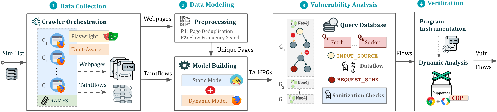

<p align="center">
	<a href="//soheilkhodayari.github.io/JAW/">
		
	</a>
</p>

<p align="center">
	<span><b> J A W</b></span>
</p>

<p align="center">
	<a href="https://soheilkhodayari.github.io/JAW/">Website</a> |
	<a href="https://github.com/SoheilKhodayari/JAW/tree/master/docs">Docs</a> |
	<a href="https://github.com/SoheilKhodayari/JAW/tree/master/docs/installation.md">Setup</a> |
	<a href="https://github.com/SoheilKhodayari/JAW/tree/master/crawler">Crawler</a> |
    <a href="#quick-start"> Quick Start </a>
	<a href="https://github.com/SoheilKhodayari/JAW/blob/master/analyses/example/example_analysis.py"> Docker (Example)</a>
</p>

# JAW


[](https://img.shields.io/badge/node%40latest-%3E%3D%206.0.0-brightgreen.svg) [](https://img.shields.io/badge/platform-windows%20%7C%20macos%20%7C%20linux-lightgrey.svg) [](https://github.com/ellerbrock/open-source-badges/) [](https://twitter.com/intent/tweet?text=A%20Static-Dynamic%20Analysis%20Framework%20for%20Client-side%20JavaScript&url=https://github.com/SoheilKhodayari/JAW)


An open-source, prototype implementation of property graphs for JavaScript based on the [esprima](https://github.com/jquery/esprima/tree/master/src) parser, and the [EsTree SpiderMonkey Spec](https://github.com/estree/estree). JAW can be used for analyzing the client-side of web applications and JavaScript-based programs.

This project is licensed under `GNU AFFERO GENERAL PUBLIC LICENSE V3.0`. See [here](LICENSE) for more information.

JAW has a Github pages website available at <a href="https://soheilkhodayari.github.io/JAW/">https://soheilkhodayari.github.io/JAW/</a>.

**Release Notes:** 

- Oct 2023, JAW-v3 (Sheriff): JAW updated to detect [client-side request hijacking](#/) vulnerabilities. 
- July 2022, JAW-v2 ([TheThing](https://github.com/SoheilKhodayari/TheThing)): JAW updated to its next major release with the ability to detect [DOM Clobbering](https://soheilkhodayari.github.io/DOMClobbering) vulnerabilities. See [`JAW-V2`](https://github.com/SoheilKhodayari/JAW/tree/JAW-v2) branch.
- Dec 2020, JAW-v1 : first prototype version. See [`JAW-V1`](https://github.com/SoheilKhodayari/JAW/tree/JAW-v1) branch.


# Content

### Overview of JAW
1. [Test Inputs](#test-inputs)
2. [Data Collection](#data-collection)
3. [HPG Construction](#hpg-construction)
4. [Analysis and Outputs](#analysis-and-outputs)
### Setup
1. [Installation](#setup-1)
### Quick Start
1. [Running the Pipeline](#running-the-pipeline)
2. [Quick Example](#quick-example)
3. [Crawling and Data Collection](#crawling-and-data-collection)
  	- [Playwright CLI with Foxhound](#playwright-cli-with-foxhound)
	- [Puppeteer-based Crawler](#puppeteer-cli)
	- [Selenium-based Crawler](#selenium-cli)
2. [Graph Construction](#graph-construction)
	- [HPG Construction CLI](#hpg-construction-cli)
	- [HPG Import CLI](#hpg-import-cli)
3. [Security Analysis](#security-analysis)
	- [Running Custom Graph traversals](#running-custom-graph-traversals)
	- [Vulnerability Detection](#vulnerability-detection)
4. [Test Web Application](#test-web-application)

### Further Information
1. [Detailed Documentation](#detailed-documentation)
2. [Contribution and Code of Conduct](#contribution-and-code-of-conduct)
3. [Academic Publication](#academic-publication)

# Overview of JAW
The architecture of the JAW is shown below.

<p align="center">
  
</p>


## Test Inputs

JAW can be used in two distinct ways:

1. **Arbitrary JavaScript Analysis:** Utilize JAW for modeling and analyzing any JavaScript program by specifying the program's file system `path`.

2. **Web Application Analysis:** Analyze a web application by providing a single seed URL.  

## Data Collection

- JAW features several JavaScript-enabled web crawlers for collecting web resources at scale. 

## HPG Construction

- Use the collected web resources to create a Hybrid Program Graph (HPG), which will be imported into a [Neo4j](https://neo4j.com/) database.

- Optionally, supply the HPG construction module with a mapping of semantic types to custom JavaScript language tokens, facilitating the categorization of JavaScript functions based on their purpose (e.g., HTTP request functions).

## Analysis and Outputs

- Query the constructed `Neo4j` graph database for various analyses. JAW offers utility traversals for data flow analysis, control flow analysis, reachability analysis, and pattern matching. These traversals can be used to develop custom security analyses.

- JAW also includes built-in traversals for detecting client-side CSRF, [DOM Clobbering](http://domclob.xyz/) and request hijacking vulnerabilities.

- The outputs will be stored in the same folder as that of input. 


# Setup

The installation script relies on the following prerequisites:
- Latest version of `npm package manager` (node js)
- Any stable version of `python 3.x`
- Python `pip` package manager

Afterwards, install the necessary dependencies via:
```bash
$ ./install.sh
```

For `detailed` installation instructions, please see [here](docs/installation.md). 


# Quick Start


## Running the Pipeline

You can run an instance of the pipeline in a background screen via: 
```bash
$ python3 -m run_pipeline --conf=config.yaml
```

The CLI provides the following options:

```
$ python3 -m run_pipeline -h

usage: run_pipeline.py [-h] [--conf FILE] [--site SITE] [--list LIST] [--from FROM] [--to TO]

This script runs the tool pipeline.

optional arguments:
  -h, --help            show this help message and exit
  --conf FILE, -C FILE  pipeline configuration file. (default: config.yaml)
  --site SITE, -S SITE  website to test; overrides config file (default: None)
  --list LIST, -L LIST  site list to test; overrides config file (default: None)
  --from FROM, -F FROM  the first entry to consider when a site list is provided; overrides config file (default: -1)
  --to TO, -T TO        the last entry to consider when a site list is provided; overrides config file (default: -1)

```


**Input Config:** JAW expects a `.yaml` config file as input. See [config.yaml](config.yaml) for an example.

**Hint.** The config file specifies different passes (e.g., crawling, static analysis, etc) which can be enabled or disabled for each vulnerability class. This allows running the tool building blocks individually, or in a different order (e.g., crawl all webapps first, then conduct security analysis). 


## Quick Example

For running a [quick example](analyses/example/example_analysis.py) demonstrating how to build a property graph and run Cypher queries over it, do:  

```bash
$ python3 -m analyses.example.example_analysis --input=$(pwd)/data/test_program/test.js
```

## Crawling and Data Collection

This module collects the data (i.e., JavaScript code and state values of web pages) needed for testing. If you want to test a specific JavaScipt file that you already have on your file system, you can **skip** this step. 

JAW has crawlers based on [Selenium](https://selenium-python.readthedocs.io/) (JAW-v1),  [Puppeteer](https://github.com/puppeteer/puppeteer) (JAW-v2, v3) and [Playwright](https://playwright.dev/) (JAW-v3). For most up-to-date features, it is recommended to use the Puppeteer- or Playwright-based versions. 

### Playwright CLI with Foxhound

This web crawler employs [foxhound](https://github.com/SAP/project-foxhound/), an instrumented version of Firefox, to perform dynamic taint tracking as it navigates through webpages. To start the crawler, do:

```bash
$ cd crawler
$ node crawler-taint.js --seedurl=https://google.com --maxurls=100 --headless=true --foxhoundpath=<optional-foxhound-executable-path>
```

The `foxhoundpath` is by default set to the following directory: `crawler/foxhound/firefox` which contains a binary named `firefox`.  


**Note:** you need a build of [foxhound](https://github.com/SAP/project-foxhound/) to use this version. An ubuntu build is included in the JAW-v3 [release](). 


### Puppeteer CLI

To start the crawler, do:

```bash
$ cd crawler
$ node crawler.js --seedurl=https://google.com --maxurls=100 --browser=chrome --headless=true
```

See [here](docs/puppeteer-crawler.md) for more information.


### Selenium CLI

To start the crawler, do:
```bash
$ cd crawler/hpg_crawler
$ vim docker-compose.yaml # set the websites you want to crawl here and save
$ docker-compose build
$ docker-compose up -d
```

Please refer to the documentation of the `hpg_crawler` [here]([https://github.com/SoheilKhodayari/TheThing/tree/master/docs/hpg-crawler.md) for more information. 


## Graph Construction


### HPG Construction CLI

To generate an HPG for a given (set of) JavaScript file(s), do:
```
$ node engine/cli.js  --lang=js --graphid=graph1 --input=/in/file1.js --input=/in/file2.js --output=$(pwd)/data/out/ --mode=csv

optional arguments:
  --lang: 	language of the input program
  --graphid:  an identifier for the generated HPG
  --input: 	path of the input program(s)
  --output: 	path of the output HPG, must be i
  --mode: 	determines the output format (csv or graphML)

```

## HPG Import CLI

To import an HPG inside a neo4j graph database (docker instance), do:

```
$ python3 -m hpg_neo4j.hpg_import --rpath=<path-to-the-folder-of-the-csv-files> --id=<xyz> --nodes=<nodes.csv> --edges=<rels.csv>
$ python3 -m hpg_neo4j.hpg_import -h

usage: hpg_import.py [-h] [--rpath P] [--id I] [--nodes N] [--edges E]

This script imports a CSV of a property graph into a neo4j docker database.

optional arguments:
  -h, --help  show this help message and exit
  --rpath P   relative path to the folder containing the graph CSV files inside the `data` directory
  --id I      an identifier for the graph or docker container
  --nodes N   the name of the nodes csv file (default: nodes.csv)
  --edges E   the name of the relations csv file (default: rels.csv)

```


## HPG Construction and Import CLI (v1)

In order to create a hybrid property graph for the output of the `hpg_crawler` and import it inside a local neo4j instance, you can also do:

```bash
$ python3 -m engine.api <path> --js=<program.js> --import=<bool> --hybrid=<bool> --reqs=<requests.out> --evts=<events.out> --cookies=<cookies.pkl> --html=<html_snapshot.html>
```

**Specification of Parameters:**

- `<path>`: absolute path to the folder containing the program files for analysis (must be under the `engine/outputs` folder).
- `--js=<program.js>`: name of the JavaScript program for analysis (default: `js_program.js`).
- `--import=<bool>`: whether the constructed property graph should be imported to an active neo4j database (default: true).
- `--hybrid=bool`: whether the hybrid mode is enabled (default: `false`). This implies that the tester wants to enrich the property graph by inputing files for any of the HTML snapshot, fired events, HTTP requests and cookies, as collected by the JAW crawler.
- `--reqs=<requests.out>`: for hybrid mode only, name of the file containing the sequence of obsevered network requests, pass the string `false` to exclude (default: `request_logs_short.out`).
- `--evts=<events.out>`: for hybrid mode only, name of the file containing the sequence of fired events, pass the string `false` to exclude (default: `events.out`).
- `--cookies=<cookies.pkl>`: for hybrid mode only, name of the file containing the cookies, pass the string `false` to exclude (default: `cookies.pkl`).
- `--html=<html_snapshot.html>`: for hybrid mode only, name of the file containing the DOM tree snapshot, pass the string `false` to exclude (default: `html_rendered.html`).


For more information, you can use the help CLI provided with the graph construction API:
```sh
$ python3 -m engine.api -h
```


## Security Analysis

The constructed HPG can then be queried using [Cypher](https://neo4j.com/docs/cypher-manual/3.5/) or the [NeoModel ORM](https://neomodel.readthedocs.io/en/latest/properties.html).

### Running Custom Graph traversals
You should place and run your queries in `analyses/<ANALYSIS_NAME>`.

#### Option 1: Using the NeoModel ORM (Deprecated)
You can use the [NeoModel ORM](https://neomodel.readthedocs.io/en/latest/properties.html) to query the HPG. To write a query:

- (1) Check out the [HPG data model](docs/hpg-nodes.md) and [syntax tree](docs/syntax-tree.md).
- (2) Check out the [ORM model](https://github.com/SoheilKhodayari/JAW/blob/master/hpg_neo4j/orm.py) for HPGs 
- (3) See the example query file provided; `example_query_orm.py` in the `analyses/example` folder.

```sh
$ python3 -m analyses.example.example_query_orm  
```


For more information, please see [here](docs/hpg-querying.md).

#### Option 2: Using Cypher Queries

You can use [Cypher](https://neo4j.com/docs/cypher-manual/3.5/) to write custom queries. For this:

- (1) Check out the [HPG data model](docs/hpg-nodes.md) and [syntax tree](docs/syntax-tree.md).
- (2) See the example query file provided; `example_query_cypher.py` in the `analyses/example` folder.

```sh
$ python3 -m analyses.example.example_query_cypher
```

For more information, please see [here](docs/hpg-querying.md).


### Vulnerability Detection

This section describes how to configure and use JAW for vulnerability detection, and how to interpret the output.
JAW contains, among others, self-contained queries for detecting client-side CSRF and DOM Clobbering

**Step 1.** enable the analysis component for the vulnerability class in the input [config.yaml](config.yaml) file:

```yaml
request_hijacking:
  enabled: true 
  # [...]
  # 
domclobbering:
  enabled: false
  # [...]

cs_csrf:
  enabled: false
  # [...]
```

**Step 2.** Run an instance of the pipeline with:
```bash
$ python3 -m run_pipeline --conf=config.yaml
```

**Hint.** You can run multiple instances of the pipeline under different `screen`s: 
```bash
$ screen -dmS s1 bash -c 'python3 -m run_pipeline --conf=conf1.yaml; exec sh'
$ screen -dmS s2 bash -c 'python3 -m run_pipeline --conf=conf2.yaml; exec sh'
$ # [...]
```

To generate parallel configuration files automatically, you may use the [`generate_config.py`](https://github.com/SoheilKhodayari/JAW/blob/master/input/generate_config.py) script.


#### How to Interpret the Output of the Analysis?
The outputs will be stored in a file called `sink.flows.out` in the same folder as that of the input. For Client-side CSRF, for example, for each HTTP request detected, JAW outputs an entry marking the set of semantic types (a.k.a, semantic tags or labels) associated with the elements constructing the request (i.e., the program slices). For example, an HTTP request marked with the semantic type `['WIN.LOC']` is forgeable through the `window.location` injection point. However, a request marked with `['NON-REACH']` is not forgeable.

An example output entry is shown below:
 
```
[*] Tags: ['WIN.LOC']
[*] NodeId: {'TopExpression': '86', 'CallExpression': '87', 'Argument': '94'}
[*] Location: 29
[*] Function: ajax
[*] Template: ajaxloc + "/bearer1234/"
[*] Top Expression: $.ajax({ xhrFields: { withCredentials: "true" }, url: ajaxloc + "/bearer1234/" })

1:['WIN.LOC'] variable=ajaxloc
	0 (loc:6)- var ajaxloc = window.location.href

```

This entry shows that on line 29, there is a `$.ajax` call expression, and this call expression triggers an `ajax` request with the url template value of `ajaxloc + "/bearer1234/`, where the parameter `ajaxloc` is a program slice reading its value at line 6 from `window.location.href`, thus forgeable through `['WIN.LOC']`.


## Test Web Application

In order to streamline the testing process for JAW and ensure that your setup is accurate, we provide a simple `node.js` web application which you can test JAW with. 

First, install the dependencies via:

```bash
$ cd tests/test-webapp
$ npm install
```

Then, run the application in a new screen: 
```bash
$ screen -dmS jawwebapp bash -c 'PORT=6789 npm run devstart; exec sh'
```

# Detailed Documentation.

For more information, visit our wiki page [here](docs/README.md). Below is a table of contents for quick access.

### The Web Crawler of JAW
- [Web Crawlers](docs/crawlers.md)

### Data Model of Hybrid Property Graphs (HPGs)
- [Property Graph Nodes](docs/hpg-nodes.md)
- [Grammar and Syntax Tree](docs/syntax-tree.md)
- [Property Graph Edges](docs/hpg-edges.md)

### Graph Construction

- [Building a Property Graph](docs/hpg-building.md)
- [Using JAW with Neo4j Docker Container](docs/neo4j-docker.md)

### Graph Traversals

- [Running Queries Over Property Graphs](docs/hpg-querying.md)


# Contribution and Code Of Conduct

Pull requests are always welcomed. This project is intended to be a safe, welcoming space, and contributors are expected to adhere to the contributor [code of conduct](CODE_OF_CONDUCT.md). 


## Academic Publication

If you use the JAW for academic research, we encourage you to cite the following [paper](https://soheilkhodayari.github.io/JAW/Paper.pdf):

```
@inproceedings{JAW,
  title = {JAW: Studying Client-side CSRF with Hybrid Property Graphs and Declarative Traversals},
  author= {Soheil Khodayari and Giancarlo Pellegrino},
  booktitle = {30th {USENIX} Security Symposium ({USENIX} Security 21)},
  year = {2021},
  address = {Vancouver, B.C.},
  publisher = {{USENIX} Association},
}   
```

## Acknowledgements

JAW has come a long way and we want to give our contributors a well-deserved shoutout here!

[@tmbrbr](https://github.com/tmbrbr), [@c01gide](https://cispa.de/en/people/c01gide), [@jndre](https://github.com/jndre), and Sepehr Mirzaei.


