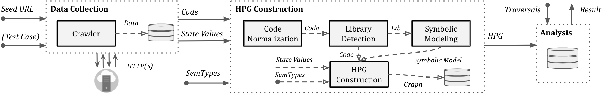

# JAW

[](https://travis-ci.org/boennemann/badges) [](https://img.shields.io/badge/node%40latest-%3E%3D%206.0.0-brightgreen.svg) [](https://img.shields.io/badge/platform-windows%20%7C%20macos%20%7C%20linux-lightgrey.svg) [](https://github.com/ellerbrock/open-source-badges/)

An open-source, prototype implementation of property graphs for JavaScript based on the [esprima](https://github.com/jquery/esprima/tree/master/src) parser, and the [Mozilla SpiderMonkey Parser API](https://developer.mozilla.org/en-US/docs/Mozilla/Projects/SpiderMonkey/Parser_API). JAW can be used for analyzing the client-side of web applications and JavaScript-based programs.

This project is licensed under `GNU AFFERO GENERAL PUBLIC LICENSE V3.0`. See [here](LICENSE) for more information.


# Content

### Overview of JAW
1. [Inputs and Data Collection](#inputs-and-data-collection)
2. [HPG Construction](#hpg-construction)
3. [Analysis and Outputs](#analysis-and-outputs)
### Setup
1. [Prerequisites](#prerequisites)
2. [Installation](#installation)
### Quick Start
1. [Data Collection](#data-collection)
	- [Inputs for Web Crawling](#inputs-for-web-crawling)
	- [How to Start the Web Crawler?](#how-to-start-the-web-crawler)
2. [Graph Construction](#graph-construction)
	- [HPG construction for a JavaScript Program](#hpg-construction-for-a-javascript-program)
	- [HPG construction for the Crawler Output](#hpg-construction-for-the-crawler-output)
3. [Analysis](#analysis)
	- [Running Custom Graph traversals](#running-custom-graph-traversals)
	- [Detecting Client-side CSRF](#detecting-client-side-csrf)
### Further Information
1. [Detailed Documentation](#detailed-documentation)
2. [Contribution and Code of Conduct](#contribution-and-code-of-conduct)

# Overview of JAW
The architecture of the JAW is shown below.

<p align="center">
  
</p>


## Inputs and Data Collection

JAW can be used in two distinct ways:

**Option 1.** Modeling and analyzing an arbitrary JavaScript program using JAW. 

In this case, the only input to the tool is the `path` of the target JavaScript program in the file system. 


**Option 2.** Analyzing a web application given a single `seed URL`. 

JAW has a stand-alone, JavaScript-enabled web crawler (based on `chromium`) that can collect the application web resources, and use them for analysis.

**Test Case Scripts.** Optionally, a so-called `test case` script or a `state` script can be provided together with the seed URL of the application in order for the crawler to reach a certain, pre-defined state (e.g., logged in state) before the crawling session starts. 
For more information about how to create such `state` script, see [here](docs/crawler.md).

**Crawler Output.** 
The crawler outputs the `JavaScript` code as well as the `State Values` for each web page found.

- `JavaScript Code`: for each web page found, JAW creates a single JavaScript file preseving the execution order of the program.
- `State Values`: state values are a collection of concrete values observed during the execution of a web page. These include the snapshot of the initial and rendered HTML page, fired events, HTTP requests and responses, and cookies. Optionally, the crawler can collect any JavaScript property accessible within the web page. 

## HPG Construction
JavaScript code and state values collected are next used to
build a HPG. The built graph is imported into a [Neo4j](https://neo4j.com/)
database.

Alternatively, the graph is built for the (arbitrary) JavaScript program given as the input by the tester

**Optional Input:** the HPG construction module can optionally be provided with a mapping of semantic types to arbitrary, tester-defined JavaScript language tokens. For example, a semantic type `REQ` can be assigned to all low-level, JavaScript functions that send an HTTP request (e.g., the Fetch API, or XMLHttpRequest). 

## Analysis and Outputs
Finally, the constructed `Neo4j` graph database can be queried for analysis.
JAW provides a series of utility traversals for data flow analysis, control flow and reachability analysis, or pattern matching, which can be leveraged for writing custom traversals for security analyses. Also, JAW includes traversals to detect client-side CSRF vulnerabilities.


# Setup

## Prerequisites
Please install the following dependencies before proceeding to the installation step:
- latest version of `npm package manager` (node js)
- any stable version of `python 3.x`
- python `pip` package manager


## Installation

Please follow the steps below in order for an smooth installation process.

### Step 1: Installing Python Dependencies
In the project root directory, run:
```sh
$ pip3 install -r requirements.txt
```

### Step 2: Installing Node Modules
In the project root directory, run:
```sh
$ cd hpg_construction
$ npm install
```
Then:
```sh
$ cd hpg_construction/lib/jaw/dom-points-to
$ npm install
```
Finally:
```sh
$ cd hpg_construction/lib/jaw/normalization
$ npm install
```

### Step 3: Installing Neo4j

**1- Install Java.**

Follow the tutorial [here](https://www.digitalocean.com/community/tutorials/how-to-manually-install-oracle-java-on-a-debian-or-ubuntu-vps) to install the latest version of Java.


**2- Install Neo4j.**

This prototype have been tested with `Neo4j 3.5.9`, community edition.
You can download the `3.5.x` version from the [neo4j download center](https://neo4j.com/download-center/#community).
You can also install it, among others, via `apt-get` or `homebrew`, as shown below.

2.1- Installing for Linux
```sh
$ cd installation
$ chmod +x neo4j_installation.sh
$ ./neo4j_installation.sh
```
For more information, see [here](https://www.alibabacloud.com/blog/installing-neo4j-on-ubuntu-16-04_594570), or [here](https://neo4j.com/developer/kb/using-apt-get-to-download-a-specific-neo4j-debian-package/).

2.2- Installing For MacOS
```sh
$ cd installation
$ brew install ./neo4j.rb
```

**Note:** the graph import commands and database activation may slightly differ across neo4j versions. 
If you want to use another version of neo4j, you need to change the graph import command (i.e., `NEO4J_IMPORT_COMMAND`), as well as the database activation logic (i.e., `dbms.active_database`) in `API_neo4j_prepare` function
of `hpg_neo4j/db_utility` package.


**3- Set the intitial Neo4j Password.**

By default, the password should be set as `root` for the user `neo4j`. If you set any other password, you also need to change it in `constants.py`.
```sh
$ neo4j-admin set-initial-password root
```

**Note**: the default username and password should be `neo4j` and `neo4j`, respectively. But this has to be changed so that neo4j allows `driver connections`. If the above command did not work, try using the `cypher-shell`:

connect to cypher shell via:
```sh
$ cypher-shell -u neo4j -p neo4j
```
then run:
```sh
CALL dbms.changePassword('root');
:exit
```

If you choose a different password, you must set it in `.env` with `NEO4J_PASS=your-password`.


**4- Make sure you can see the followings (uncommented) in your `neo4j.conf` file:**
```
dbms.connector.bolt.enabled=true
dbms.connector.bolt.listen_address=0.0.0.0:7687 
```

### Step 4: Setup Enviornment Variables

Copy the `example.env`  and rename it to `.env`.
- Set your operating system:
	- `PLATFORM=linux`
	- `PLATFORM=macos`
- If you choose a different password than that of step 3, you must set it in `.env` with `NEO4J_PASS=your-password`.

**Note**: you may use the tool in windows. This requires changing the `neo4j` configuration varibles (e.g., NEO4J_CONF) in `constants.py`. In addition, you should change the
`API_neo4j_prepare` function in `main.py` by replacing the `sed` bash command to that of windows (or simply provide a similar copying logic).

### Further Information about Neo4j

Neo4j example DB import synax:
```sh
$ neo4j-admin import --mode=csv --database=graph.db --nodes=nodes.csv --relationships=rels.csv --delimiter='¿'
```
See: [Neo4j import documentation](https://neo4j.com/docs/operations-manual/current/tools/import/) for more!


Environment configuration on OS X:
```sh
$ export NEO4J_HOME="/usr/local/Cellar/neo4j/3.5.9/libexec"
```

# Quick Start

## Data Collection
This module collects the data (i.e., JavaScript code and state values of web pages) needed for testing.

If you want to test a specific JavaScipt file that you already have on your file system, you can **skip** this step. 

### Inputs for Web Crawling
JAW can crawl and collect the web resources for a given set of web application.
The inputs to the tool are thus a list of sites' `seed URLs`, and an optional `test case` or `state` script for each site under test.

**Action 1:** Specify the set of sites for testing by adding new entries in the `SITES_MAP` dictionary in `hpg_crawler/sites/sitemap.py`.
As shown below, you should assign each site an **integer** id, a name, and a seed URL.


```
SITES_MAP = {
	'1': ('example-name-1', 'https://example1.com', ),
	'2': ('example-name-2', 'https://example2.com', ),
}

```

**Action 2 (Optional):** For each site specified, you can input a custom `test case` or `state` script that gives instructions to the crawler to reach a certain state of the application (e.g., logged in) before the crawling session starts.

- To create a new `state` script for a site, copy the `sites/template` folder and rename it to `sites/<site-id>` where `<site-id>` is the id you set in `sitemap.py` for that site, e.g., `sites/1`.
- Add your `selenium-based` state functions in `sites/<SITE_ID>/scripts/Auth.py` for the target site. See the example `Auth.py` file for more information.

### How to Start the Web Crawler?
In order to start the crawler for a given `<site-id>`, run:
```sh
$ cd hpg_crawler
$ python3 driver.py <site-id>
``` 
Alternatively, you can run the crawler for a list of sites, i.e., from an integer `<start-site-id>` to the integer `<end-site-id>` (inclusive), according to the integer id values specified in `hpg_crawler/sites/sitemap.py`. Thus, you can run:
```sh
$ cd hpg_crawler
$ python3 driver.py <start-site-id> <end-site-id>
``` 
For example, `python3 driver.py 1 5` crawls websites with id one to five from `hpg_crawler/sites/sitemap.py`.

For more information about the web crawler of JAW, see [here](docs/crawler.md).


## Graph Construction

In order to create a hybrid property graph for the output of the crawler or a given JavaScript program, you can use the following general command:

```sh
$ python3 -m hpg_construction.api <path> --js=<program.js> --import=<bool> --hybrid=<bool> --reqs=<requests.out> --evts=<events.out> --cookies=<cookies.pkl> --html=<html_snapshot.html>
```

**Specification of Parameters:**

- `<path>`: base path to the folder containing the program files for analysis (must be under the `hpg_construction/outputs` folder).
- `--js=<program.js>`: name of the JavaScript program for analysis (default: `js_program.js`).
- `--import=<bool>`: whether the constructed property graph should be imported to an active neo4j database (default: true).
- `--hybrid=bool`: whether the hybrid mode is enabled (default: `false`). This implies that the tester wants to enrich the property graph by inputing files for any of the HTML snapshot, fired events, HTTP requests and cookies, as collected by the JAW crawler.
- `--reqs=<requests.out>`: for hybrid mode only, name of the file containing the sequence of obsevered network requests, pass the string `false` to exclude (default: `request_logs_short.out`).
- `--evts=<events.out>`: for hybrid mode only, name of the file containing the sequence of fired events, pass the string `false` to exclude (default: `events.out`).
- `--cookies=<cookies.pkl>`: for hybrid mode only, name of the file containing the cookies, pass the string `false` to exclude (default: `cookies.pkl`).
- `--html=<html_snapshot.html>`: for hybrid mode only, name of the file containing the DOM tree snapshot, pass the string `false` to exclude (default: `html_rendered.html`).


For more information, you can use the help CLI provided with the graph construction API:
```sh
$ python3 -m hpg_construction.api -h
```

**Note:** To add and assign custom semantic types to JavaScript language tokens (suitable for the specific type of analysis you are doing), you can input them in `hpg_construction/lib/jaw/semantictypes.js`.


**Note:** Alternatively, one can use the following two steps for graph construction, which is more suited for debugging purposes.

#### Building the Graph CSV Files
The javascript analyzer modules creates the `nodes.csv` and `rels.csv` files for analysis (the property graph).

In the project root directory, try:
```sh
$ node hpg_construction/main.js -js <RELATIVE_PATH_TO_TEST_FILE> -o <OUTPUT_FOLDER_NAME>
```
For example:
```sh
$ node hpg_construction/main.js -js hpg_construction/test-inputs/test.js -o myfolder
```

#### Importing into Neo4j

In the project root directory, run:
```sh
$ python3 -m hpg_neo4j.hpg_import <path-to-the-folder-of-the-csv-files> --nodes=nodes.csv --edges=rels.csv
```
Run the help CLI command for more information:
```sh
$ python3 -m hpg_neo4j.hpg_import -h

```

### HPG construction for a JavaScript Program
To construct a HPG for an arbitrary JavaScript file, simply run:
```sh
$ python3 -m hpg_construction.api <path> --js=<program.js>
```
In the above command, the parameter `<path>` is the base path to the folder containing the program files for analysis (must be under the `hpg_construction/outputs` folder), and the 
parameter `--js=<program.js>` specifies the name of the JavaScript program for analysis.


### HPG construction for the Crawler Output
To construct a HPG for a given web page output by the crawler, simply run:
```sh
$ python3 -m hpg_construction.api <path>
```
In the above command, the `<path>` parameter is the location of the folder containing the target web page for analysis (output by the crawler), e.g., `<BASE_PATH>/hpg_construction/outputs/example-app/example-page`.


## Analysis

The constructed HPG can then be queried using [Cypher](https://neo4j.com/docs/cypher-manual/3.5/) or the [NeoModel ORM](https://neomodel.readthedocs.io/en/latest/properties.html).

### Running Custom Graph traversals
You should place and run your queries in `hpg_analysis/<ANALYSIS_NAME>`.

#### Option 1: Using the NeoModel ORM
You can use the [NeoModel ORM](https://neomodel.readthedocs.io/en/latest/properties.html) to query the HPG. To write a query:

(1) Check out the [HPG data model](docs/hpg-nodes.md) and [syntax tree](docs/syntax-tree.md).
(2) Check out the [ORM model](https://github.com/SoheilKhodayari/JAW/blob/master/hpg_neo4j/orm.py) for HPGs 
(3) See the example query file provided; `exampleorm.py` in the `hpg_analysis/example` folder.

```sh
$ python3 -m hpg_analysis.example.exampleorm  
```


For more information, please see [here](docs/hpg-querying.md).

#### Option 2: Using Cypher Queries

You can use [Cypher](https://neo4j.com/docs/cypher-manual/3.5/) to write custom queries. For this:

(1) Check out the [HPG data model](docs/hpg-nodes.md) and [syntax tree](docs/syntax-tree.md).
(2) See the example query file provided; `example.py` in the `hpg_analysis/example` folder.

```sh
$ python3 -m hpg_analysis.example.example
```

For more information, please see [here](docs/hpg-querying.md).


### Detecting Client-side CSRF
This section describes how to configure and run the client-side CSRF analyzer, and how to interpret its output.

#### How to Run the Analysis Script?
In the root directory, run
```sh
$ python3 -m hpg_analysis.cs_csrf.main
```
This will build the property graph, creates a neo4j database and queries the database for client-side CSRF vulnerabilities. 

**Note:** By default, the testing process
is done for the unit tests specified under `hpg_construction/unit_tests/cs_csrf`. 
However, the analysis script has three different run modes:
- (i) Detecting vulnerabilities in a specific web page
- (i) Detecting vulnerabilities in a specific web site, i.e., all web pages of that site
- (iii) Detecting vulnerabilities in unit test files


The active run mode can be adjusted by changing the hardcoded value of the `ACTIVE_MODE` parameter at the top of the script.

``` python
ENUM_TEST_WEB_PAGE = 0 		 # case (i)
ENUM_TEST_WEB_SITE = 1		 # case (ii)
ENUM_UNIT_TEST = 2			 # case (iii)

ACTIVE_MODE = ENUM_UNIT_TEST # change this value to change the active run mode of the script

```

For case (i) and (ii), to specify the exact site or URL to test, modify the hardcoded `site_identifer` and `url` variables at the end of the file.

#### How to Interpret the Output of the Analysis?
The outputs will be stored in a file called `template.out` in the same folder as that of the input. For each HTTP request detected, JAW outputs an entry marking the set of semantic types (a.k.a, semantic tags or labels) associated with the elements constructing the request (i.e., the program slices). For example, an HTTP request marked with the semantic type `['WIN.LOC']` is forgeable through the `window.location` injection point. However, a request marked with `['NON-REACH']` is not forgeable.

 An example output entry is shown below:
 
```
[*] Tags: ['WIN.LOC']
[*] NodeId: {'TopExpression': '86', 'CallExpression': '87', 'Argument': '94'}
[*] Location: 29
[*] Function: ajax
[*] Template: ajaxloc + "/bearer1234/"
[*] Top Expression: $.ajax({ xhrFields: { withCredentials: "true" }, url: ajaxloc + "/bearer1234/" })

1:['WIN.LOC'] variable=ajaxloc
	0 (loc:6)- var ajaxloc = window.location.href

```

This entry shows that on line 29, there is a `$.ajax` call expression, and this call expression triggers an `ajax` request with the url template value of `ajaxloc + "/bearer1234/`, where the parameter `ajaxloc` is a program slice reading its value at line 6 from `window.location.href`, thus forgeable through `['WIN.LOC']`.


# Detailed Documentation.

For more information, visit our wiki page [here](docs/jaw.md). Below is a table of contents for quick access.

### The Web Crawler of JAW
- [Web Crawler](docs/crawler.md)

### Data Model of Hybrid Property Graphs (HPGs)
- [Property Graph Nodes](docs/hpg-nodes.md)
- [Grammar and Syntax Tree](docs/syntax-tree.md)
- [Property Graph Edges](docs/hpg-edges.md)

### Graph Construction

- [Building a Property Graph](docs/hpg-building.md)

### Graph Traversals

- [Running Queries Over Property Graphs](docs/hpg-querying.md)


# Contribution and Code Of Conduct
Pull requests are welcomed. Please see the contributor [code of conduct](CODE_OF_CONDUCT.md). 


